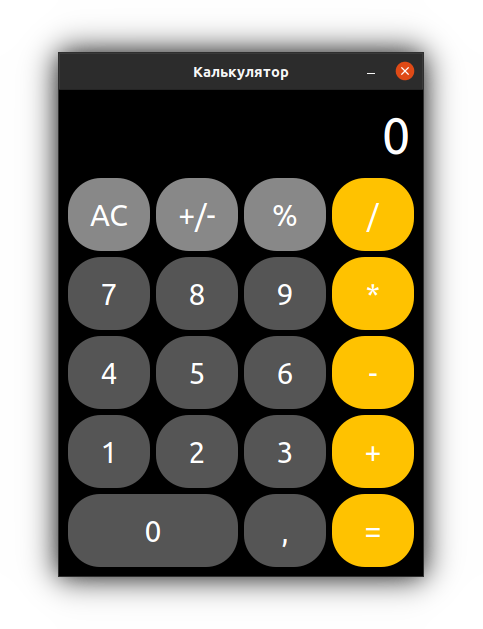

# dp93-calculator program
Calculator program, designed like Apple. Developed with
using Qt software development framework, version 5.x and C++.

### Programming features used in code
* Buttons created in ui and connected in one slot by using array of pointers with loop
* UI developed in Qt Designer and elements designed by QCC
* Program uses translations mechanism realised by QTranslator
* For copying result using QMenu and QClipboard
* Supported input by keys realised by keyboard events QKeyEvent
* Icon stores in Qt resource file
* If allow to resize window then program will be normal resizing by responsive layout

### Keyboard shortcuts
| Key        | Description                        |
| ---------- | ---------------------------------- |
| 0 - 9      | Numeric keys for inputing a number |
| +, -, *, / | Arifmetic actions                  |
| , or .     | Floating point                     |
| = or Enter | Get result                         |
| Esc        | Reset all calculations             |

## Thank You!
Please ⭐️ this repo and share it with others

### Screenshot

### Requirements 🔧
* Qt 5.x
* GNU C++

### Installation 🔌
1. Download the repository files (project) from the download section or clone this project by typing in the bash the following command:

       git clone https://github.com/dpopov93/dp93-calculator.git
3. Imported it in Qt Creator
4. Build and run the application

### Contributing 💡
If you want to contribute to this project and make it better with new ideas, your pull request is very welcomed.
If you find any issue just put it in the repository issue section, thank you.
