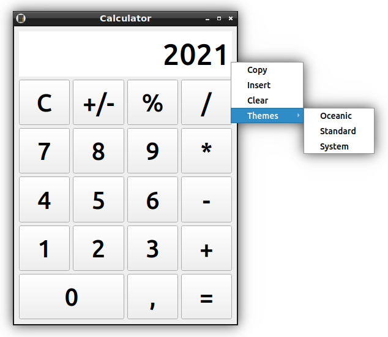
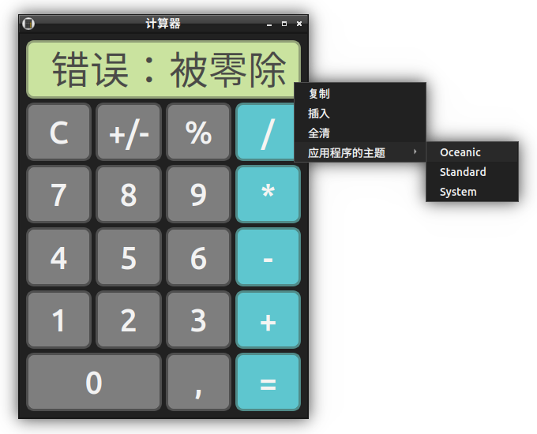

# dp93-calculator program
Calculator program, designed like Apple with theme customizing.
Developed with using Qt software development framework, version 5.x and C++.

### Programming features used in code
* Buttons created in ui and connected in one slot by using array of pointers with loop
* UI developed in Qt Designer and elements designed by QCC
* Program uses translations mechanism realised by QTranslator
* Language support for English, Russian and Chinese
* For copying result, pasting and clear value using QMenu and QClipboard
* Quick change theme through context menu
* Parsing UI theme from file
* Ctrl + C and Ctrl + V for copy and paste result
* QEvent detecting mouse click on calc display and remove last number
* Supported input by keys realised by keyboard events QKeyEvent
* Icon stores in Qt resource file
* If allow to resize window then program will be normal resizing by responsive layout

### Keyboard shortcuts
| Key        | Description                        |
| ---------- | ---------------------------------- |
| 0 - 9      | Numeric keys for inputing a number |
| +, -, *, / | Arifmetic actions                  |
| , or .     | Floating point                     |
| = or Enter | Get result                         |
| Backspace  | Remove last number                 |
| Esc        | Reset all calculations             |
| Ctrl + C   | Copy result                        |
| Ctrl + V   | Insert result                      |
| Ctrl + Q   | Close application                  |

## Thank You!
Please ⭐️ this repo and share it with others

### Screenshots

### Requirements 🔧
* Qt 5.x
* GNU C++

### Installation 🔌
1. Download the repository files (project) from the download section or clone this project by typing in the bash the following command:

       git clone https://github.com/dpopov93/dp93-calculator.git
3. Imported it in Qt Creator
4. Build and run the application

### Contributing 💡
If you want to contribute to this project and make it better with new ideas, your pull request is very welcomed.
If you find any issue just put it in the repository issue section, thank you.
